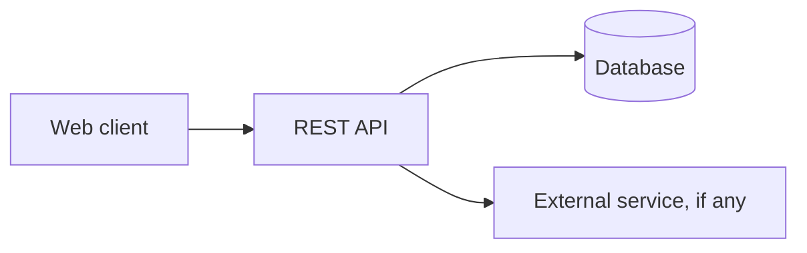

# DevDash'26 Project Report

**Team name:** TODO
**Team members:** TODO
**Repository:** TODO
**Problem statement:** TODO (one sentence)

> Judging: the report is worth 6 marks. It should clearly document design, architecture, and
> testing with evidence. Fill each section as features land, not at the end.
> Delete these guidance notes (blockquotes) from the final version.

---

## 1. Introduction

### 1.1 Problem understanding
> What is the problem, who are the users, what pain are we solving? 1-2 short paragraphs.

### 1.2 Our solution in brief
> 3-5 sentences: what the product is and what makes our approach useful.

### 1.3 Scope and priorities
> What we chose to build first and why; what we left out and why.
> Link to REQUIREMENTS.md and summarise the traceability table below.

| ID | Requirement | Priority | Status | Implemented in |
|----|-------------|----------|--------|----------------|
| | | | | |

---

## 2. Design

### 2.1 Users and roles
> Table of roles and what each can do.

### 2.2 Key user flows
> 2-4 flows described in steps or with a simple flow diagram (e.g. Mermaid).

### 2.3 UI design decisions
> Layout, navigation, accessibility, responsive choices. Add 3-5 screenshots.

---

## 3. Architecture

### 3.1 System overview
> Architecture diagram: client, API, database, external services.

### 3.2 Technology stack and why

| Layer | Choice | Reason |
|-------|--------|--------|
| Frontend | | |
| Backend | | |
| Database | | |
| Testing | | |
| Tooling | | |

### 3.3 Data model
> ER diagram and short description of each main entity and relationship.

### 3.4 API design
> Table of main endpoints: method, path, purpose, auth/role required.

| Method | Path | Purpose | Auth / role |
|--------|------|---------|-------------|
| | | | |

### 3.5 Project structure
> Short tree of the main folders and the responsibility of each.

---

## 4. Implementation highlights

> Pick 3-4 of the most complex features and describe how they work and why they are non-trivial
> (algorithms, business rules, conflict handling, concurrency, scoring, etc.).
> This is where "high complexity" is demonstrated for the depth marks.

### 4.1 Feature: TODO
- What it does:
- How it works:
- Edge cases handled:

### 4.2 Feature: TODO

### 4.3 Differentiator / innovation: TODO

---

## 5. Non-functional quality

| Area | What we did | Where |
|------|-------------|-------|
| Authentication and authorisation | | |
| Input validation | | |
| Error handling | | |
| Security | | |
| Performance (pagination, indexing, etc.) | | |
| Responsiveness and accessibility | | |
| Logging | | |
| Code quality (structure, linting, constants) | | |

---

## 6. Testing

### 6.1 Strategy
> Types of tests, what they cover, why.

### 6.2 Test cases and results

| ID | Area | Scenario | Expected | Result |
|----|------|----------|----------|--------|
| T-01 | | | | Pass |

### 6.3 Evidence
> Paste terminal output of the test run and screenshots of key manual tests.
> Include the exact command used to run tests.

### 6.4 Known issues
> Honest list of bugs or gaps and their impact.

---

## 7. Setup and running

> Short version; full instructions are in README.md.
> Prerequisites, install, environment variables, seed data, run, test commands, demo accounts.

---

## 8. Limitations and future work

- Left out on purpose (and why):
- Known limitations:
- Next steps with more time:

---

## 9. Third-party libraries, APIs, and AI usage

> Paste the final version of DISCLOSURES.md here (required by the rules).

---

## 10. Team contributions

| Member | Main responsibilities | Key commits / areas |
|--------|-----------------------|---------------------|
| | | |
