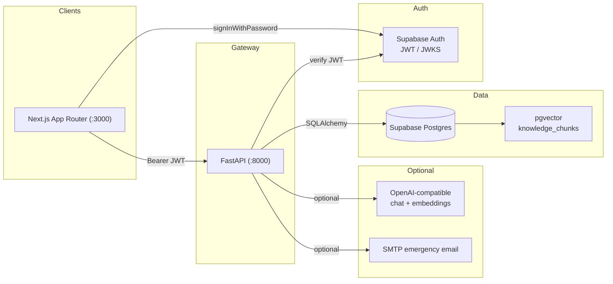
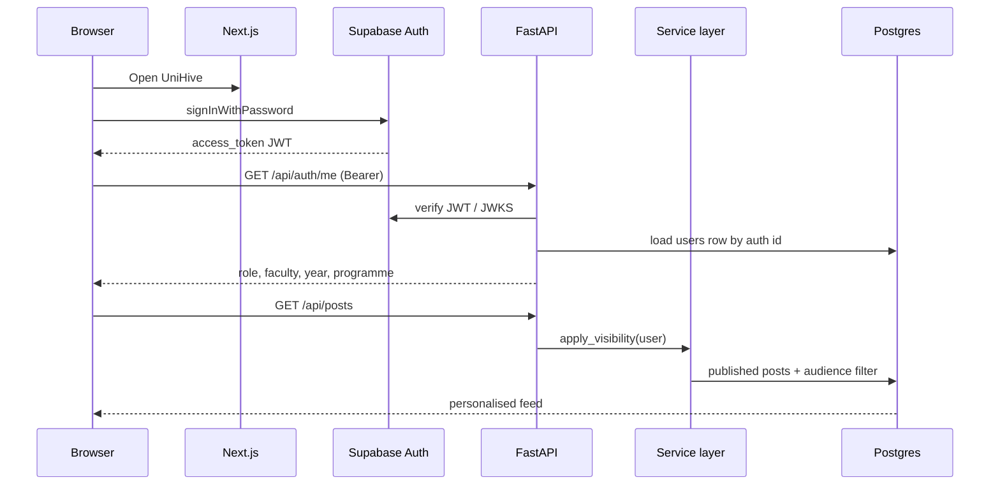
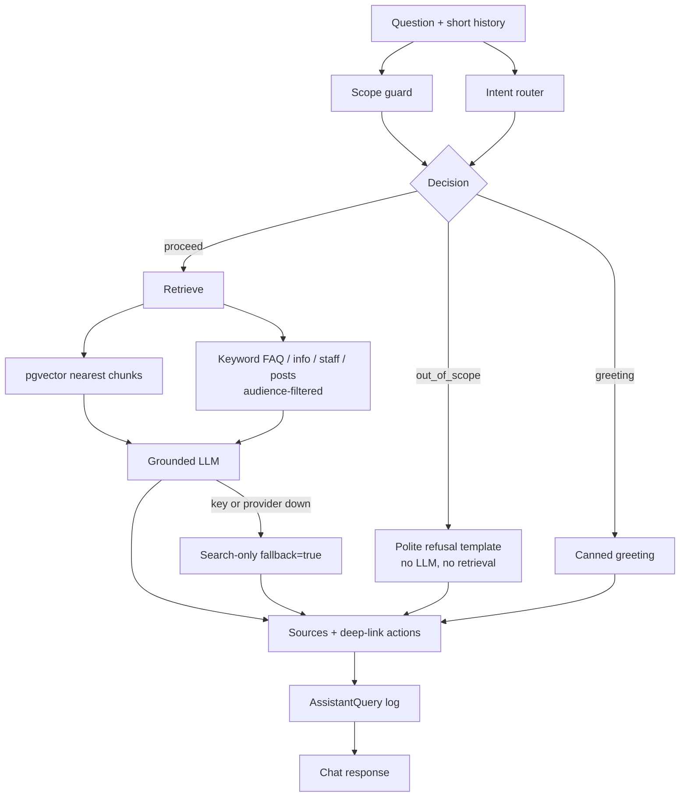
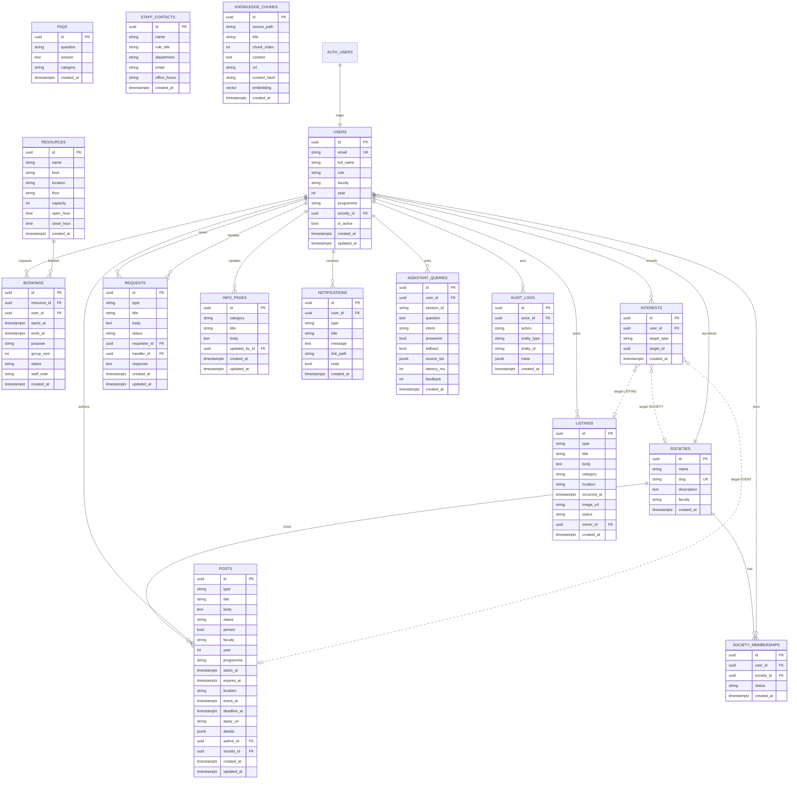

<p align="center">
  
  
  
  
  
  
  
</p>

# UniHive

> **Everything campus. One place.** — Universal College Lanka’s trusted digital home for announcements, events, societies, bookings, lost & found, campus services, and an AI assistant.

UniHive is a campus hub for Universal College Lanka. Students currently get information from WhatsApp groups, notice boards, lecturers, and word of mouth. UniHive is **one official channel** with role-based publishing, faculty/year/programme targeting, self-service bookings and requests, and **UniHive AI** that answers in English, Sinhala, or Singlish and deep-links to the right action.

We did not build 33 separate apps. We built **five engines** (posts, info, bookings, requests, listings) plus a small platform layer (users, notifications, audit, assistant log). Many requirements map onto those engines.

---

## Table of Contents

- [Key Features](#-key-features)
- [System Architecture](#-system-architecture)
- [Five Engines](#-five-engines)
- [Roles and Permissions](#-roles-and-permissions)
- [UniHive AI Pipeline](#-unihive-ai-pipeline)
- [Memory System](#-memory-system)
- [Retrieval Strategies](#-retrieval-strategies)
- [Emergency Fan-out](#-emergency-fan-out)
- [Voice Pipeline](#-voice-pipeline)
- [Tech Stack](#-tech-stack)
- [Entity-Relationship Diagram](#-entity-relationship-diagram)
- [Project Structure](#-project-structure)
- [Instructions and Running](#-instructions-and-running)
- [Demo Accounts](#-demo-accounts)
- [Deployment](#-deployment)
- [CI/CD Pipeline](#-cicd-pipeline)
- [Configuration](#-configuration)
- [API Reference](#-api-reference)
- [Observability](#-observability)
- [Testing](#-testing)
- [Documentation](#-documentation)
- [License](#-license)

---

## ✨ Key Features

| Feature | Description |
|---|---|
| **Unified campus feed** | One home, global search, and personalised posts. Anonymous users see campus-wide items; signed-in students see faculty / year / programme targeting. |
| **Post engine** | One table, eleven types: announcements, events, guest lectures, emergencies, schedule changes, academic calendar, jobs, volunteering, alumni, highlights, society updates. |
| **Audience targeting** | Null audience field = everyone for that field. A student sees a post only if every non-null `faculty` / `year` / `programme` matches their profile. |
| **Server-side RBAC** | `PERMISSION_ROLES` + `require_permission()`. The UI hides buttons; FastAPI is the authority. Students cannot publish announcements (403). |
| **Classroom and sports booking** | Request a room without a phone call. Overlap returns 409. Duration 30–240 minutes, 08:00–20:00, at most 14 days ahead. Admin approve / reject + in-app notification. |
| **Lost & found and textbooks** | Same listing engine. Contact is an Interest row with first name only — no emails or phone numbers in the UI. |
| **Requests** | Academic support, facility issues, and feedback on one status machine: `OPEN → IN_PROGRESS → RESOLVED \| CLOSED`. Role-specific handlers. |
| **Campus info hub** | FAQ (Singlish-aware search), onboarding, directory, financial aid, dining, printing, wellbeing, IT, library, sports. |
| **UniHive AI** | Scope guard → intent → pgvector / keyword retrieve → grounded LLM (or search fallback) → sources + deep-link actions → query log. Staff insights on unanswered questions. |
| **Emergency communication** | Site banner, in-app `Notification` rows, optional SMTP email, browser toast while the tab is open. No SMS (no phone numbers stored). |

---

## 🏗️ System Architecture

### High-level overview

Campus tables are **not** exposed through PostgREST. RLS is enabled with no anon policies. The browser uses supabase-js only to sign in. FastAPI + SQLAlchemy is the only data path.



### Request path



### Layering

| Layer | Owns | Does not own |
|---|---|---|
| **Next.js** | Screens, zod forms, role-aware nav, loading/empty/error states | Permissions, targeting, booking overlap |
| **Routers** | Parse Pydantic input, call a service, return a schema | Business rules |
| **Services** | Targeting, conflicts, status transitions, emergency fan-out | HTTP, ORM-only mapping |
| **Models / schemas** | Tables and request/response shapes | Rules |
| **Assistant** | Guard, intent, retrieve, answer, log | Extra orchestration frameworks |

Two processes only: backend on `:8000`, frontend on `:3000`. One command each, or `make dev`.

---

## 🧩 Five Engines

Few generic tables, many requirements. This is the design that lets a 6-hour build stay deep instead of shallow.

| Engine | Models | Requirements served |
|---|---|---|
| **Post** | `Post` (`type`, audience, schedule, pin, status, `society_id`) | Announcements, events, lectures, emergency, schedule, calendar, jobs, volunteering, alumni, highlights, society updates |
| **Info** | `InfoPage`, `Faq`, `StaffContact` | FAQ, onboarding, directory, aid, dining, printing, wellbeing, IT, library, sports info |
| **Booking** | `Resource(kind)`, `Booking(status)` | Classrooms and sports facilities |
| **Request** | `Request(type, status)` | Academic support, facility issues, feedback |
| **Listing** | `Listing`, `Interest`, `SocietyMembership` | Lost & found, textbooks, event interest, society sign-up |
| **Platform** | `User`, `Society`, `Notification`, `AssistantQuery`, `AuditLog`, `knowledge_chunks` | Profiles, AI log, publish audit, booking/emergency alerts, RAG |

**Audience rule:** a student sees a post if every non-null `faculty` / `year` / `programme` matches their profile. Null on a field means “everyone for that field”. Staff see all published posts. Anonymous callers see only campus-wide posts.

**Booking rules (constants, not magic numbers):** 30–240 minutes, 08:00–20:00, at most 14 days ahead, overlapping `PENDING`/`APPROVED` bookings return 409.

**Request transitions:** `OPEN → IN_PROGRESS → RESOLVED | CLOSED`. Academics handle academic support; only admin/super-admin handle facility issues and feedback.

**Listing lifecycle:** `ACTIVE → RESOLVED | REMOVED`. Default list is `LOST` + `FOUND`; textbooks use `type=TEXTBOOK`.

---

## 🔐 Roles and Permissions

Roles live in our `users` table, not in JWT `app_metadata`. Defined once in `backend/app/constants.py`.

| Role | Can do |
|---|---|
| **STUDENT** | Personalised feed, search, events/societies interest, bookings, listings, requests, assistant, profile |
| **ACADEMIC** | Publish announcements / calendar / guest lectures for **own faculty**; handle academic support |
| **SOCIETY_REP** | Publish events, society updates, and highlights for **own society** |
| **FINANCE** | Profile; financial-aid FAQs via API |
| **ADMIN** | Emergencies, jobs, volunteering, alumni, booking approve/reject, listing moderate, FAQ create, assistant insights |
| **SUPER_ADMIN** | Admin plus user/role management (permission exists; admin user list UI is fixture-only for the demo) |

Ownership (own faculty / own society / own post) is checked in the service layer, not with scattered `if role ==` in routers.

| Action | Roles allowed |
|---|---|
| View published content | Everyone (audience filter for students) |
| Publish `ANNOUNCEMENT`, `CALENDAR_ENTRY`, `GUEST_LECTURE` | ACADEMIC (own faculty), ADMIN, SUPER_ADMIN |
| Publish `EVENT` | ACADEMIC, SOCIETY_REP (own society), ADMIN, SUPER_ADMIN |
| Publish `SOCIETY_UPDATE`, `HIGHLIGHT` | SOCIETY_REP (own society), ADMIN, SUPER_ADMIN |
| Publish `EMERGENCY`, `SCHEDULE_CHANGE` | ADMIN, SUPER_ADMIN |
| Publish `JOB`, `VOLUNTEERING`, `ALUMNI` | ADMIN, SUPER_ADMIN |
| Manage financial-aid info | FINANCE, ADMIN |
| Manage other info / FAQ / directory | ADMIN, SUPER_ADMIN |
| Edit or archive a post | Author, or ADMIN / SUPER_ADMIN |
| Create booking | Any logged-in user |
| Approve / reject bookings | ADMIN, SUPER_ADMIN |
| Create requests | Any logged-in user |
| Handle academic support | ACADEMIC, ADMIN |
| Handle facility issues and feedback | ADMIN, SUPER_ADMIN |
| Create listings | Any logged-in user |
| Moderate listings | ADMIN |
| View assistant insights | ADMIN, SUPER_ADMIN |

---

## 🤖 UniHive AI Pipeline

Plain Python functions. No LangChain, LangGraph, or MCP. Every teammate can explain each step.



| Step | Module | What it does |
|---|---|---|
| 1. Scope | `assistant/guard.py` | Greetings, off-topic, and unsafe content. Refusal is a template — no invented answer. |
| 2. Intent | `assistant/router.py` | `INFO`, `EVENT`, `BOOKING`, `LOST_FOUND`, `SUPPORT`, `SOCIETY`, `OTHER` (keyword + Sinhala tokens). |
| 3. Language | `assistant/language.py` | Detect English, Sinhala script, and Singlish particles so retrieval strips noise and replies match the student. |
| 4. Retrieve | `assistant/retrieval.py` | Embed the question, nearest `knowledge_chunks` via pgvector; merge keyword hits from FAQs, info pages, staff directory, and published posts the user may see. |
| 5. Answer | `assistant/llm.py` + `prompts.py` | LLM may use **only** retrieved context. Timeout and one retry. If the key/provider fails, return search-only with `fallback=true`. |
| 6. Guide | `assistant/service.py` | Attach sources plus deep links (`/bookings`, `/lost-found`, `/requests/new`, …). |
| 7. Learn | `AssistantQuery` | Staff see unanswered / low-rated questions on `/staff/assistant`. |

Knowledge files (chunked at seed when `LLM_API_KEY` is set):

- `backend/knowledge/campus-services.md`
- `backend/knowledge/student-services.md`
- `backend/knowledge/library.md`
- `backend/knowledge/it.md`

Seed indexed **11 chunks, 11 embeddings** via pgvector when the embedding key is present. If embeddings or the extension are missing, the same chunks are searched with keyword `ILIKE`.

---

## 🧠 Memory System

| Store | Isolation | Behaviour |
|---|---|---|
| **Session memory** | `session_id` in process-local `deque` | Last `ASSISTANT_MAX_HISTORY_TURNS` (6) user/assistant turns. Caps token use. Lost on process restart — enough for a demo conversation. |
| **Query log** | `AssistantQuery` row | Question, intent, answered, fallback, source ids, latency, thumbs feedback. Powers staff insights. |
| **User profile** | `users.id` = Supabase `auth.users.id` | Faculty, year, programme drive feed targeting and retrieval visibility. No password column in our DB. |

---

## 🔍 Retrieval Strategies

| Strategy | Description | Use case |
|---|---|---|
| **pgvector RAG** | Embed the question (`text-embedding-3-small`, 1536 dims), nearest `knowledge_chunks`. | Library hours, IT, campus policy from markdown. |
| **Keyword SQL** | Tokenise (Singlish-aware), `ILIKE` over FAQs, info pages, staff contacts, published posts. | Live campus content the markdown files do not cover. |
| **Audience filter** | `apply_visibility` on post hits. | A Computing student never gets a Business-only announcement as a source. |
| **Search-only fallback** | If the LLM is unset or down, return retrieved snippets with `fallback=true`. | Demo still works on a hotspot without a chat key. |

There is **no Qdrant cluster** and no external vector database. Chunks live in the same Postgres.

---

## 🚨 Emergency Fan-out

Publishing a `PUBLISHED` `EMERGENCY` post (admin / super-admin only):

1. Post is stored like any other type (pinned, banner-eligible).
2. `notify.dispatch_emergency` writes an in-app `Notification` for every active user who matches the audience.
3. After commit, optional SMTP emails those users (`SMTP_HOST` / `SMTP_FROM`). If mail is unset, the server **logs the recipient count** so the demo still shows the path.
4. Open UniHive tabs can show a **browser Notification** toast (`frontend/src/lib/emergency-alert.ts`). No service worker, no FCM, no SMS.

Schedule-change posts use the same banner treatment without the email fan-out.

---

## 🎙️ Voice Pipeline

*Out of scope for this hackathon.* UniHive AI is typed chat with multilingual replies. A real-time voice tutor is not required by the problem statement and would add a third process and a flaky network dependency.

---

## 🛠️ Tech Stack

### Backend

| Component | Technology | Why |
|---|---|---|
| Runtime | **Python 3.11+** | Typed, pytest-friendly |
| HTTP | **FastAPI** + Uvicorn | Thin routers, OpenAPI at `/docs` |
| ORM | **SQLAlchemy 2.0** | Explicit models, indexes, transactions |
| Validation | **Pydantic v2** + pydantic-settings | Request constraints and env config |
| Database | **Supabase Postgres** + **pgvector** | Hosted DB a small admin office can keep; same DB for RAG |
| Auth | **Supabase Auth** (JWT / JWKS) | Managed passwords; FastAPI still owns roles |
| LLM | Optional OpenAI-compatible chat + embeddings | Search fallback if the key is missing |
| Mail | stdlib `smtplib` | Optional emergency email |
| Tests | **pytest** | One command: `make test` |

Documented deviation from the written SQLite + custom-JWT stack: hosted Postgres and managed auth so a small office does not run a database. The demo needs a network path to Supabase (hotspot is the backup).

### Frontend

| Component | Technology | Why |
|---|---|---|
| Framework | **Next.js 16** App Router + **React 19** | Official scaffold, one web client |
| Language | **TypeScript** (strict) | Shared types with API schemas |
| Styling | **Tailwind CSS 4** + shadcn/ui | Mobile-first UniHive shell |
| Forms | **zod** | Client validation that matches the server |
| Auth client | **@supabase/supabase-js** | `signInWithPassword` only |
| Icons / motion | lucide-react, sonner, motion | Nav, toasts, dashboard tickers |

### What we deliberately did **not** add

LangChain, LangGraph, MCP, Qdrant, Redis, message brokers, native apps, extra vector DBs. If something seemed to need new infrastructure, we used Postgres or an in-process structure instead.

---

## 📐 Entity-Relationship Diagram

Full schema as implemented in `backend/app/models/` plus `knowledge_chunks` (created in `db.py` / `knowledge_store.py`). `users.id` equals Supabase `auth.users.id`. Passwords never live in campus tables.



### Enums (stored as strings)

| Column family | Values |
|---|---|
| `users.role` | `STUDENT`, `ACADEMIC`, `SOCIETY_REP`, `FINANCE`, `ADMIN`, `SUPER_ADMIN` |
| `users.faculty` / post audience | `COMPUTING`, `BUSINESS`, `ENGINEERING` |
| `posts.type` | `ANNOUNCEMENT`, `EVENT`, `GUEST_LECTURE`, `EMERGENCY`, `SCHEDULE_CHANGE`, `CALENDAR_ENTRY`, `JOB`, `VOLUNTEERING`, `ALUMNI`, `HIGHLIGHT`, `SOCIETY_UPDATE` |
| `posts.status` | `DRAFT`, `PUBLISHED`, `ARCHIVED` |
| `resources.kind` | `CLASSROOM`, `SPORTS` |
| `bookings.status` | `PENDING`, `APPROVED`, `REJECTED`, `CANCELLED` |
| `requests.type` | `ACADEMIC_SUPPORT`, `FACILITY_ISSUE`, `FEEDBACK` |
| `requests.status` | `OPEN`, `IN_PROGRESS`, `RESOLVED`, `CLOSED` |
| `listings.type` | `LOST`, `FOUND`, `TEXTBOOK` |
| `listings.status` | `ACTIVE`, `RESOLVED`, `REMOVED` |
| `interests.target_type` | `EVENT`, `SOCIETY`, `LISTING` |
| `society_memberships.status` | `INTERESTED`, `MEMBER` |
| `notifications.type` | `BOOKING_UPDATE`, `POST_PUBLISHED`, `REQUEST_UPDATE`, `LISTING_UPDATE`, `EMERGENCY`, `SYSTEM` |
| `info_pages.category` | `FAQ`, `ONBOARDING`, `DIRECTORY`, `FINANCIAL_AID`, `DINING`, `PRINTING`, `WELLBEING`, `IT`, `LIBRARY`, `SPORTS` |

### Indexes and constraints

| Table | Notes |
|---|---|
| `posts` | Composite indexes on `(type, status)`, audience `(faculty, year, programme)`, `starts_at`, `expires_at` |
| `bookings` | Index on `(resource_id, starts_at, ends_at, status)` for overlap checks |
| `interests` | Unique `(user_id, target_type, target_id)` — duplicate interest is 409 |
| `society_memberships` | Unique `(user_id, society_id)` |
| `knowledge_chunks` | Unique `(source_path, chunk_index)`; optional `embedding vector(1536)` |
| All campus tables | RLS enabled, **no anon policies** — the publishable key cannot read campus data |

`Interest` is polymorphic: `target_type` + `target_id` points at a post (event), society, or listing. There is no FK to all three tables on purpose so one engine can serve BR4, BR6, and listing contact.

---

## 📁 Project Structure

```
Team-Axiom/
├── backend/
│   ├── app/
│   │   ├── main.py              # app factory, CORS, routers, lifespan
│   │   ├── config.py            # pydantic-settings from .env
│   │   ├── constants.py         # roles, enums, permission map, limits
│   │   ├── db.py                # engine, RLS, knowledge_chunks bootstrap
│   │   ├── security.py          # JWT verify, require_permission
│   │   ├── errors.py            # {error: {code, message}}
│   │   ├── seed.py              # invented demo users and campus data
│   │   ├── models/              # SQLAlchemy tables
│   │   ├── schemas/             # Pydantic request/response
│   │   ├── routers/             # thin HTTP
│   │   ├── services/            # posts, bookings, listings, requests, societies, notify
│   │   └── assistant/           # guard → intent → retrieve → answer → log
│   ├── knowledge/               # campus markdown → pgvector chunks
│   ├── tests/                   # pytest
│   └── requirements.txt
├── frontend/
│   └── src/
│       ├── app/                 # App Router pages (student / staff / admin)
│       ├── components/          # layout, posts, bookings, UI primitives
│       ├── hooks/
│       ├── lib/                 # api.ts, auth, constants, permissions
│       └── types/
├── Makefile                     # install, seed, dev, test
├── render.yaml                  # UniHive API on Render
├── .env.example
├── README.md
├── REQUIREMENTS.md
├── DISCLOSURES.md
├── DEMO.md
└── REPORT.md
```

---

## 🚀 Instructions and Running

### Prerequisites

| Tool | Version |
|------|---------|
| Python | 3.11+ |
| Node.js | 18+ (npm) |
| Supabase | Cloud project (Auth + Postgres + pgvector extension) |

Disable public sign-ups on the Supabase project. Seed creates the demo users.

### 1. Environment

Copy [`.env.example`](.env.example) to `.env` at the repo root and fill the values.

Copy [`frontend/.env.example`](frontend/.env.example) to `frontend/.env.local` with the public keys and `NEXT_PUBLIC_API_URL`.

### 2. Install, seed, run

```bash
make install
make seed
make dev
```

| Process | URL |
|---------|-----|
| API | http://localhost:8000 |
| OpenAPI | http://localhost:8000/docs |
| App | http://localhost:3000 |

`make seed` is idempotent. It creates Auth users (service role), campus rows, and re-indexes markdown when `LLM_API_KEY` is set.

Re-index knowledge after editing markdown:

```bash
cd backend && .venv/bin/python -m app.assistant.index_knowledge
```

On Windows, use `.venv\Scripts\python` instead of `.venv/bin/python`.

### 3. Tests

```bash
make test
```

Needs `DATABASE_URL`. Auth is overridden except for the invalid-JWT case. The LLM and Auth Admin APIs are not called in unit tests.

---

## 👤 Demo Accounts

Password for every account: `CampusHub!2026`

| Role | Email | Notes |
|------|--------|-------|
| Student | `nimali.perera@student.ucl.lk` | Computing, year 2 |
| Student | `kasun.fernando@student.ucl.lk` | Business, year 1 |
| Academic | `dr.jayasuriya@ucl.lk` | Computing |
| Society rep | `anuki.silva@student.ucl.lk` | Axiom Computing Club |
| Finance | `finance.office@ucl.lk` | |
| Admin | `admin@ucl.lk` | Can publish announcements and emergencies |
| Super admin | `superadmin@ucl.lk` | |

Sign in as Nimali, then Kasun, to show faculty targeting. Students cannot publish announcements (403). Invented names only; no real personal data.

Pitch steps: [DEMO.md](DEMO.md).

---

## ☁️ Deployment

| Piece | Where |
|-------|--------|
| **Frontend** | Next.js on Vercel (or any Node host). Set `NEXT_PUBLIC_API_URL` and the two public Supabase keys. |
| **API** | Render Blueprint in [`render.yaml`](render.yaml): `uvicorn app.main:app --host 0.0.0.0 --port $PORT`, health check `/health`, Python 3.11.11. |
| **Database + Auth** | Supabase. Enable the **pgvector** extension (Dashboard → Database → Extensions). |
| **LLM** | Optional. Leave `LLM_API_KEY` blank and UniHive AI stays in search-only fallback. |

CORS must include the deployed frontend origin (`CORS_ORIGINS`).

The app will not run without Supabase credentials and a network path. For the live demo, keep a hotspot ready.

---

## 🔄 CI/CD Pipeline

There is no GitHub Actions workflow in this repo (hackathon time-box). The intended path:

| Stage | What |
|-------|------|
| Local | `make test` before every push. `main` / `dev` must always run. |
| API | Render deploys `backend/` from `render.yaml` on the configured branch. |
| Web | Vercel (or equivalent) builds `frontend/`. |
| Seed | Run `make seed` against the hosted DB after schema bootstrap; `create_all` does not migrate existing columns. |

Commit history is scored. Push every 30–60 minutes. Submission is the team GitHub repo at lock time.

---

## ⚙️ Configuration

Runtime is controlled by `.env` (git-ignored) and named constants in `constants.py`. Never put the service role in Next.js.

| Variable | Where | Purpose |
|----------|--------|---------|
| `DATABASE_URL` | backend | Session-pooler or direct Postgres URI (`postgresql+psycopg://…`) |
| `SECRET_KEY` | backend | App secret (not used as the password hasher; Auth is Supabase) |
| `SUPABASE_URL` | backend | Project URL for JWT JWKS and Auth Admin |
| `SUPABASE_JWT_SECRET` | backend | HS256 verify (optional if the project uses JWKS only) |
| `SUPABASE_SERVICE_ROLE_KEY` | backend / seed only | Create demo Auth users |
| `CORS_ORIGINS` | backend | Default `http://localhost:3000` |
| `LLM_API_KEY` / `LLM_BASE_URL` / `LLM_MODEL` | backend | Optional chat completions for grounded answers |
| `EMBEDDING_MODEL` | backend | Optional embeddings for markdown RAG (default `text-embedding-3-small`) |
| `SMTP_HOST` / `SMTP_PORT` / `SMTP_FROM` | backend | Optional emergency email. Blank = log count only |
| `SMTP_USER` / `SMTP_PASSWORD` / `SMTP_USE_TLS` | backend | Optional SMTP auth (default TLS on) |
| `NEXT_PUBLIC_API_URL` | frontend | FastAPI base URL |
| `NEXT_PUBLIC_SUPABASE_URL` | frontend | Auth client |
| `NEXT_PUBLIC_SUPABASE_PUBLISHABLE_KEY` or `ANON_KEY` | frontend | Auth client only |

Assistant limits (not env): `ASSISTANT_TOP_K=5`, history 6 turns, question cap 1000 chars, timeout 20s, chunk size 700 / overlap 100, embedding dimensions 1536.

---

## 📡 API Reference

Interactive docs: http://localhost:8000/docs

Consistent error shape: `{"error": {"code": "...", "message": "..."}}`. Status codes: 400, 401, 403, 404, 409 (conflicts), 422 (validation).

List endpoints take `page` and `page_size` (default 20, max 50) unless noted.

### Health

| Method | Path | Auth | Description |
|--------|------|------|-------------|
| `GET` | `/health` | No | Liveness |
| `GET` | `/ready` | No | Database reachable; assistant configured or fallback mode |

### Auth

| Method | Path | Auth | Description |
|--------|------|------|-------------|
| `GET` | `/api/auth/me` | Bearer | Campus profile (role, faculty, year, programme) |
| `PATCH` | `/api/auth/me` | Bearer | Update name / faculty / year / programme |

Login is Supabase Auth in the browser, not this API.

### Posts

| Method | Path | Auth | Description |
|--------|------|------|-------------|
| `GET` | `/api/posts` | Optional | Published feed with audience filter; `type` query |
| `GET` | `/api/posts/mine` | Bearer | Author’s posts |
| `GET` | `/api/posts/{id}` | Optional | One post |
| `POST` | `/api/posts` | Permission by type | Create (type-specific fields validated) |
| `PATCH` | `/api/posts/{id}` | Author or admin | Edit / archive |
| `POST` | `/api/posts/{id}/interest` | Bearer | Register event interest |
| `GET` | `/api/posts/{id}/interests` | Optional | Organiser interest list (names, not emails) |

### Search

| Method | Path | Auth | Description |
|--------|------|------|-------------|
| `GET` | `/api/search` | Optional | Posts; FAQ, society, and room extras on page 1 |

### Info

| Method | Path | Auth | Description |
|--------|------|------|-------------|
| `GET` | `/api/info/pages` | No | Seeded info pages; `category` filter |
| `GET` | `/api/info/faqs` | No | Paginated FAQ search |
| `GET` | `/api/info/faqs/check` | Bearer | Duplicate-question check |
| `POST` | `/api/info/faqs` | Info manage | Create FAQ |
| `GET` | `/api/info/contacts` | No | Official staff directory |

### Bookings

| Method | Path | Auth | Description |
|--------|------|------|-------------|
| `GET` | `/api/resources` | Logged-in | Classrooms and sports spaces |
| `GET` | `/api/bookings` | Logged-in | Mine, or staff queue |
| `POST` | `/api/bookings` | Logged-in | Request a slot (409 on overlap) |
| `PATCH` | `/api/bookings/{id}` | Owner cancel / admin approve-reject | Status + staff note |

### Societies

| Method | Path | Auth | Description |
|--------|------|------|-------------|
| `GET` | `/api/societies` | Optional | List |
| `GET` | `/api/societies/{slug}` | Optional | Detail |
| `POST` | `/api/societies/{slug}/interest` | Bearer | Sign-up interest |
| `GET` | `/api/societies/{slug}/interests` | Staff | Membership list |

### Listings

| Method | Path | Auth | Description |
|--------|------|------|-------------|
| `GET` | `/api/listings` | Optional | Default `LOST`+`FOUND`; `type=TEXTBOOK` for exchange |
| `POST` | `/api/listings` | Logged-in | Report item or list a book |
| `GET` | `/api/listings/{id}` | Optional | Detail |
| `PATCH` | `/api/listings/{id}` | Owner or moderator | Resolve / update |
| `POST` | `/api/listings/{id}/interest` | Bearer | In-app contact (first name only) |
| `GET` | `/api/listings/{id}/interests` | Owner / staff | Who reached out |

### Requests

| Method | Path | Auth | Description |
|--------|------|------|-------------|
| `GET` | `/api/requests` | Logged-in | Mine or staff queue |
| `POST` | `/api/requests` | Logged-in | Academic support, facility, feedback |
| `GET` | `/api/requests/{id}` | Logged-in | Detail |
| `PATCH` | `/api/requests/{id}` | Handler role | Legal status transitions only (else 409) |

### Assistant

| Method | Path | Auth | Description |
|--------|------|------|-------------|
| `POST` | `/api/assistant/chat` | Bearer | `{answer, sources[], actions[], intent, language, fallback, escalated, query_id}` |
| `POST` | `/api/assistant/feedback` | Bearer | Thumbs on a `query_id` |
| `GET` | `/api/admin/assistant/insights` | ADMIN / SUPER_ADMIN | Unanswered and low-rated questions |

### Notifications

| Method | Path | Auth | Description |
|--------|------|------|-------------|
| `GET` | `/api/notifications` | Bearer | Latest 20 for the current user (booking outcomes, emergencies) |

---

## 📊 Observability

No hosted tracing product (LangFuse / OpenTelemetry) — extra infrastructure was out of scope.

| Signal | Where |
|--------|--------|
| Liveness / readiness | `GET /health`, `GET /ready` |
| Structured errors | Server `logging` on unhandled exceptions; generic client message, never a stack trace |
| Assistant latency | `AssistantQuery.latency_ms` |
| Content gaps | `GET /api/admin/assistant/insights` and `/staff/assistant` |
| Sensitive actions | `AuditLog` (publish, edit, archive) |
| Emergency email | SMTP send, or log of recipient count if unset |
| Secrets | Never logged; `.env` is git-ignored |

---

## 🧪 Testing

```bash
make test
```

| File | Coverage |
|------|----------|
| `test_auth.py` | 401 without token, garbage JWT, profile GET/PATCH |
| `test_posts.py` | Targeting, 403s by role, validation 422, create/edit/archive, event interest, search audience |
| `test_bookings.py` | Create, overlap 409, student cannot approve, admin approve |
| `test_societies.py` | List + student interest |
| `test_listings.py` | Lost item + textbook, resolve ownership, duplicate interest 409 |
| `test_requests.py` | Create, illegal skip 409, academic vs facility handler |
| `test_info.py` | FAQ search (Singlish), duplicate check, category pages |
| `test_assistant.py` | Out-of-scope refusal, sources/actions, lost-ID action, staff directory, admin insights 403 |
| `test_assistant_language.py` | Sinhala / Singlish / English detection |
| `test_knowledge_chunks.py` | Markdown split + bundled files load |
| `test_emergency_notify.py` | Audience match, in-app rows, no SMTP required |

Live pytest against a shared hosted database can contend with seed/demo traffic. Prefer `make test` on a quiet clone for judging evidence.

---

## 📚 Documentation

| File | Purpose |
|------|---------|
| [REQUIREMENTS.md](REQUIREMENTS.md) | Numbered BRs, status, where implemented, what we cut and why |
| [DISCLOSURES.md](DISCLOSURES.md) | Libraries, APIs, datasets, AI use |
| [DEMO.md](DEMO.md) | 8-minute pitch script and accounts |
| [REPORT.md](REPORT.md) | Design, architecture, testing evidence, limitations |

---

## 📄 License

DevDash’26 hackathon submission for **Team Axiom**. All application code in this repository was written during the hackathon window. No pre-built project or private template was used. See [DISCLOSURES.md](DISCLOSURES.md).

Demo data is invented. The UCL mark is used only in the demo UI.

---

<p align="center">
  Built by Team Axiom for DevDash’26
</p>
