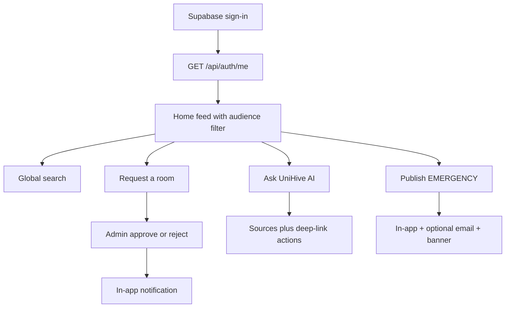
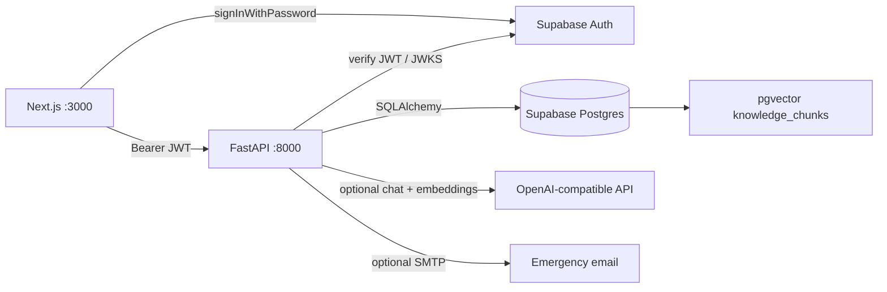
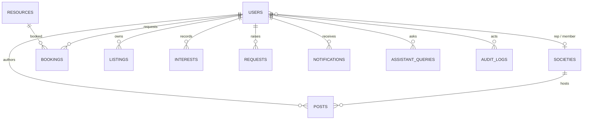

# DevDash’26 Project Report

**Team:** Team Axiom  
**Product:** UniHive — Everything campus. One place.  
**Repository:** [DevDash-26/Team-Axiom](https://github.com/DevDash-26/Team-Axiom) — submission is **`main`** at lock time  
**Problem:** UCL students get campus information from WhatsApp, notice boards, and word of mouth. UniHive is one trusted channel for announcements, events, societies, bookings, support, and an AI assistant.

---

## 1. Introduction

### 1.1 Problem understanding

Information is scattered, so students miss deadlines and staff repeat the same answers. Faculties and years need different messages; societies need a place to publish; rooms need a booking path that does not start with a phone call. The office that will keep this running has no dedicated engineering team.

Users: students (personalised feed and self-service), academics (faculty-scoped publishing and academic support), society representatives (own-society events), finance (aid information), admins (emergencies, bookings, moderation).

### 1.2 Solution in brief

A web app: Next.js for UniHive UI, FastAPI for every campus data path, Supabase for Postgres and managed Auth. **Five engines** (posts, info, bookings, requests, listings) map many BRs onto few tables. UniHive AI sits on top: campus markdown is chunked into **pgvector**, answers are grounded in retrieved sources, and the student is sent to the right action.

### 1.3 Priorities (what we finished, what we cut)

Demo-critical path first: auth, audience targeting, home, staff publish. Then events / societies / bookings. Then requests, listings, info, remaining post types, assistant RAG, emergency fan-out.

We cut a second CMS for info pages, an external vector database, SMS, and native apps so the core stayed **deep** rather than 33 thin screens. Official problem statement §7: not every category must be equal.

Traceability: [REQUIREMENTS.md](REQUIREMENTS.md). **22 of 33 BRs Done**, 11 Partial, 0 Not done.

| ID | Requirement | Status | Where |
|----|-------------|--------|-------|
| BR1 | Unified home + search | Done | `/`, `GET /api/search` |
| BR2 | Targeted announcements | Partial | `apply_visibility`; programme unseeded |
| BR3–BR6 | Events, interest, societies | Done | posts + societies + Interest |
| BR7 | Lost & found | Done | listings engine |
| BR8 | Classroom / facility booking | Done | overlap 409, staff approve |
| BR9, BR17, BR21 | Support, feedback, facility | Done | request engine + role handlers |
| BR10, BR13, BR16, BR20, BR28 | FAQ, calendar, schedule, jobs, lectures | Done | info + post types |
| BR11–BR12 | Content maintenance, access levels | Partial | RBAC real; admin user pages are fixtures |
| BR14, BR22, BR25–BR26, BR30–BR31 | Onboarding, directory, dining, printing, IT, library | Partial | seeded pages, no CMS |
| BR15 | Emergency communication | Done | banner + in-app + optional SMTP |
| BR18–BR19, BR32 | Volunteering, alumni, highlights | Done | post types |
| BR23–BR24, BR27, BR29 | Aid, sports booking, textbooks, wellbeing | Done | info + booking + listings |
| BR33 | AI assistant | Partial | pgvector RAG + fallback + staff insights |

---

## 2. Design

### 2.1 Roles

Roles live in our `users` table, not in JWT `app_metadata`. The UI hides buttons; FastAPI is the authority (`PERMISSION_ROLES` + `require_permission`).

| Role | Can do |
|------|--------|
| STUDENT | Personalised feed, search, interest, bookings, listings, requests, assistant, profile |
| ACADEMIC | Publish announcements / calendar / guest lectures for **own faculty**; handle academic support |
| SOCIETY_REP | Publish events, updates, highlights for **own society** |
| FINANCE | Profile; financial-aid FAQs via API |
| ADMIN | Emergencies, jobs, volunteering, alumni, booking review, listing moderate, FAQ create, AI insights |
| SUPER_ADMIN | Admin plus user/role permission (user-list UI is fixture-only) |

### 2.2 Key flows (demo)



- **Targeting:** Nimali (Computing, year 2) and Kasun (Business, year 1) see different posts from the same database.
- **Booking:** student requests a room → overlap is **409** → admin approves → student is notified in-app.
- **Assistant:** “library hours” or “lost my ID” → retrieved chunk/FAQ → short answer with sources and a link.
- **Emergency:** admin publishes → matching users get a `Notification`; SMTP sends or logs a count; open tabs poll the banner.

### 2.3 UI decisions

- One App Shell (student / staff / admin) from the same role map.
- Mobile-first, plain labels, loading / empty / error / success states.
- Lost & found contact shows **first names only**.
- Do not demo `/admin/users` or `/admin/staff` (fixtures). Demo staff **queues** (content, bookings, requests), not dashboard count cards.

---

## 3. Architecture

### 3.1 System overview

Two processes. Campus tables are **not** on PostgREST. RLS is on with **no anon policies**; the publishable key can only sign in.



| Layer | Choice | Reason |
|-------|--------|--------|
| Frontend | Next.js App Router, TypeScript, Tailwind, zod | Official scaffold, typed forms |
| Backend | FastAPI, SQLAlchemy 2, Pydantic v2 | Thin routers, services own rules |
| Database | Supabase Postgres + pgvector | Hosted DB; RAG without a second cluster |
| Auth | Supabase Auth | Managed passwords; FastAPI owns roles |
| LLM | Optional OpenAI-compatible | Search fallback if the key is down |
| Mail | stdlib `smtplib` | Optional; log count if unset |

Deviation from written SQLite + custom JWT: a small office should not run a database. Demo needs a network path to Supabase.

### 3.2 Layering

Routers parse input and call a service. Services own targeting, overlap, status transitions, and emergency fan-out. Models are tables; schemas are request/response. No business rules in UI components.

### 3.3 Engines and data model



`users.id` = Supabase `auth.users.id`. No password column in campus tables.

| Engine | Models | Requirements |
|--------|--------|----------------|
| Post | `Post` (type, audience, schedule, pin, status, society_id) | Announcements, events, lectures, emergency, schedule, calendar, jobs, volunteering, alumni, highlights, society updates |
| Info | `InfoPage`, `Faq`, `StaffContact` | FAQ, onboarding, directory, aid, dining, printing, wellbeing, IT, library, sports info |
| Booking | `Resource(kind)`, `Booking(status)` | Classrooms and sports |
| Request | `Request(type, status)` | Academic support, facility issues, feedback |
| Listing | `Listing`, `Interest`, `SocietyMembership` | Lost & found, textbooks, event interest, society sign-up |
| Platform | `User`, `Society`, `Notification`, `AssistantQuery`, `AuditLog`, `knowledge_chunks` | Profiles, alerts, AI log, publish audit, RAG |

**Audience:** a student sees a post if every non-null `faculty` / `year` / `programme` matches. Null = everyone for that field. Staff see all published posts. Anonymous callers see campus-wide only.

**Booking constants:** 30–240 minutes, 08:00–20:00, at most 14 days ahead; overlapping `PENDING`/`APPROVED` → 409.

**Requests:** `OPEN → IN_PROGRESS → RESOLVED | CLOSED`. Academics handle academic support; only admin/super-admin handle facility and feedback.

**Interest** is polymorphic (`target_type` + `target_id`) so one engine serves events, societies, and listing contact. Unique `(user_id, target_type, target_id)` → 409 on duplicate.

Indexes: posts `(type, status)`, audience, `starts_at`/`expires_at`; bookings `(resource_id, starts_at, ends_at, status)`.

### 3.4 API surface

Interactive docs: `/docs`. Errors: `{"error":{"code","message"}}` with 401 / 403 / 404 / 409 / 422.

| Area | Paths |
|------|--------|
| Health | `GET /health`, `GET /ready` |
| Auth | `GET/PATCH /api/auth/me` |
| Posts | `GET/POST /api/posts`, get/patch, interest |
| Search | `GET /api/search` |
| Info | `/api/info/pages`, `/faqs`, `/contacts` |
| Bookings | `/api/resources`, `/api/bookings` |
| Societies | `/api/societies`, interest |
| Listings | `/api/listings` (`LOST`+`FOUND` default; `type=TEXTBOOK`) |
| Requests | `/api/requests` with legal transitions only |
| Assistant | `POST /api/assistant/chat`, feedback, `GET /api/admin/assistant/insights` |
| Notifications | `GET /api/notifications` |

---

## 4. Implementation highlights

### 4.1 Permission map

Actions are keys in `PERMISSION_ROLES` (`backend/app/constants.py`). Ownership (own faculty / own society / own post) is in the service layer. Students cannot publish announcements (403). Academics cannot publish another faculty’s announcement or handle facility issues. Only admins approve bookings and publish emergencies.

### 4.2 UniHive AI (BR33)

Plain functions. No LangChain / LangGraph.

1. **Scope** — refuse off-topic or unsafe with a template (no LLM).
2. **Intent** — INFO, EVENT, BOOKING, LOST_FOUND, SUPPORT, SOCIETY, OTHER.
3. **Language** — English, Sinhala script, Singlish particles.
4. **Retrieve** — embed the question; nearest `knowledge_chunks` via pgvector; merge keyword hits from FAQs, info, staff, and visible posts. If embeddings are missing, keyword `ILIKE` on the same chunks.
5. **Answer** — LLM may use only retrieved context. Timeout + one retry. If the key/provider fails → search-only, `fallback=true`.
6. **Guide** — sources plus deep links (`/bookings`, `/lost-found`, `/requests/new`, …).
7. **Learn** — `AssistantQuery` log; staff insights on `/staff/assistant`.

Knowledge: `backend/knowledge/{campus-services,student-services,library,it}.md`. Seed indexed **11 chunks, 11 embeddings** when `LLM_API_KEY` is set (2026-09-19).

### 4.3 Emergency fan-out (BR15)

On first publish of an `EMERGENCY` post:

1. Banner (and schedule-change) on every App Shell, polled every 15s.
2. `notify.dispatch_emergency` writes `Notification` rows for matching active users (same audience rule as the feed).
3. After commit, optional SMTP. If `SMTP_HOST` / `SMTP_FROM` are unset, log `would notify N users` — demo still works offline for mail.
4. Open tabs: sonner toast + browser `Notification` API. No FCM, no service worker, no SMS (no phone numbers stored).

Edits to an already-live emergency do not re-fan-out.

### 4.4 Supabase boundary

Browser uses supabase-js **only** to sign in. Seed uses the service role to create Auth users. Demo password `CampusHub!2026` is in the README. No real student data.

---

## 5. Non-functional quality

| Area | What we did |
|------|-------------|
| AuthZ | JWT verify + `require_permission` on mutating routes |
| Validation | Pydantic + zod; 422 on empty title / bad dates / unknown faculty |
| Errors | `{error:{code,message}}`; UI empty / error / retry |
| Security | RLS, no anon table access, no service role in Next.js, no author emails on posts |
| Conflicts | Booking overlap 409; unique Interest; FAQ duplicate check |
| Privacy | Lost & found = first name only |
| Reliability | `/health`; `/ready` reports DB; assistant fallback if LLM is down |
| Logging | Unhandled errors; assistant latency; emergency email count; no secrets |
| Maintainability | Layers, named constants, idempotent seed, `make install/seed/dev/test` |

---

## 6. Testing

### 6.1 Strategy

pytest against the configured Postgres URL. Auth is overridden except for the invalid-JWT case. LLM and Auth Admin are not called. Run: `make test` (needs `DATABASE_URL`).

### 6.2 Inventory — **79 cases**

| File | Count | Coverage |
|------|------:|----------|
| `test_auth.py` | 4 | 401, garbage JWT, profile GET/PATCH |
| `test_posts.py` | 23 | Targeting, 403s, 422s, create/edit/archive, event interest, search |
| `test_bookings.py` | 4 | Create, overlap 409, student cannot approve, admin approve |
| `test_societies.py` | 2 | List + interest |
| `test_listings.py` | 8 | Lost item + textbook, resolve, duplicate 409 |
| `test_requests.py` | 7 | Create, illegal skip 409, academic vs facility |
| `test_info.py` | 9 | FAQ search (Singlish), duplicate check, category pages |
| `test_assistant.py` | 7 | Refusal, sources/actions, lost-ID, insights 403 |
| `test_assistant_language.py` | 5 | Sinhala / Singlish / English |
| `test_knowledge_chunks.py` | 2 | Markdown split + bundled files |
| `test_emergency_notify.py` | 8 | Audience fan-out, draft skip, SMTP unset / send / fail-soft |

### 6.3 Evidence

| ID | Scenario | Expected | Status |
|----|----------|----------|--------|
| T-01 | No token / garbage JWT | 401 | Written |
| T-02 | Computing vs Business students | Different visible titles | Written |
| T-03 | Student creates announcement | 403 | Written |
| T-04 | Empty title | 422 | Written |
| T-05 | Overlapping booking | 409 | Written |
| T-06 | Academic handles facility issue | 403 | Written |
| T-07 | Off-topic assistant question | Refusal, no invented answer | Written |
| T-08 | Seed knowledge index | 11 chunks, 11 embeddings | Verified 2026-09-19 (`make seed`) |
| T-09 | Computing emergency vs Business student | In-app row only for matching audience; SMTP optional | Written (`test_emergency_notify.py`, 8 passed 2026-09-19) |

Live pytest against the shared hosted database can contend with seed/demo traffic. Prefer `make test` on a quiet clone for judging.

### 6.4 Known issues

- The app will not run without Supabase credentials and a network path.
- `create_all` does not migrate existing columns.
- Shared demo DB is not isolated; tests use rollback but can still see live rows.

---

## 7. Setup

See [README.md](README.md).

```bash
make install
make seed
make dev
```

API http://localhost:8000 · app http://localhost:3000. Pitch: [DEMO.md](DEMO.md).

---

## 8. Limitations and future work

**Left out on purpose (pitch)**

| What | Why |
|------|-----|
| Separate app per BR | Engine reuse; depth scores higher than 33 thin screens |
| Qdrant / extra vector DB | pgvector on the same Postgres |
| Info-page CMS | Seed is the maintenance path in 6 hours |
| SMS / FCM push | No phone numbers; privacy; extra vendor. Email + in-app + banner instead |
| Native apps, dark mode, analytics | Responsive web was enough |
| University SIS | Not available; no integration assumed |
| `/admin/users` live API | RBAC is real via 403s; fixture pages would look fake |

**Known limitations**

- Hosted Supabase is a single-network dependency (hotspot backup).
- Info pages are read-only in the UI (FAQ create exists for admins).
- Programme targeting exists on the form but is unseeded (demo faculty vs year).
- Assistant quality depends on markdown coverage and the embedding/chat key.

**After the hackathon**

- Info CMS if staff must edit pages without re-seeding.
- Isolated test database.
- Rate limits on assistant chat for semester-start load.

---

## 9. Third-party libraries, APIs, and AI

See [DISCLOSURES.md](DISCLOSURES.md).

AI (Cursor) was an aid for scaffolding, tests, and docs. Architecture, permission matrix, audience rule, and engine model were team decisions. Every committed change was reviewed. The assistant RAG pattern (retrieve → ground → cite → fallback) was written for this repo; we did not copy a prior team project or a LangChain stack.

---

## 10. Team contributions

| Member | Main areas (from commit history) |
|--------|----------------------------------|
| Mirco Fernando | Backend engines (posts, requests, listings, bookings, societies), emergency notify, API wiring, merges to `dev` / `main` |
| Nethmi Imasha Arachchi | UniHive AI (multilingual, markdown/pgvector RAG), FAQ intelligence, Render deploy |
| Dhanuja Senarathna | Frontend UI, UniHive branding, student/staff navigation, lost & found / opportunities / profile |
| Mahdi Hannan | Repository bootstrap |

Each teammate should speak to the parts they committed. Technical Q&A: backend / auth / RAG and frontend / UI as above.
