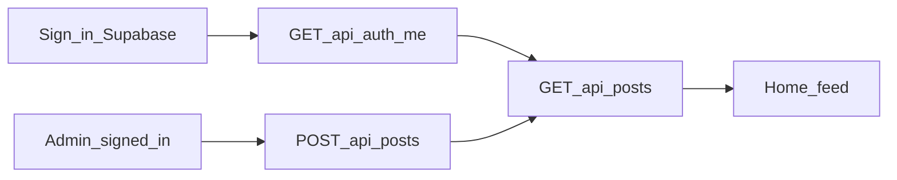
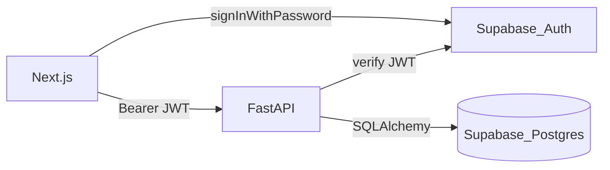

# DevDash'26 Project Report

**Team name:** Team Axiom
**Team members:** TODO
**Repository:** Team-Axiom
**Problem statement:** UCL students get campus information from scattered channels; we are building one trusted hub with role-aware content and services.

---

## 1. Introduction

### 1.1 Problem understanding

Students and staff at Universal College Lanka currently rely on WhatsApp groups, notice boards, and word of mouth. That is slow, uneven, and hard for a small admin office to maintain. We need one official place for announcements, events, societies, bookings, and support.

### 1.2 Our solution in brief

UCL Campus Hub is a web app with a FastAPI backend and a Next.js frontend. Content is stored as a few reusable engines (posts, info, bookings, requests, listings). Hour 0 delivers sign-in, the full schema, and a personalised home feed so later features can share the same models and permission map.

### 1.3 Scope and priorities

Hour 0: auth, RBAC, seed, targeted posts, home feed. Later waves add events, booking, the assistant, and info pages. See [REQUIREMENTS.md](REQUIREMENTS.md).

| ID | Requirement | Priority | Status | Implemented in |
|----|-------------|----------|--------|----------------|
| BR12 | Access levels | 1 | Partial | `security.py`, Supabase Auth |
| BR2 | Targeted announcements | 1 | Partial | `post_service.py`, home feed |
| BR1 | Home feed | 1 | Partial | `frontend/src/app/page.tsx` |
| BR11 | Staff publish | 1 | Partial | `POST /api/posts`, `/posts/new` |

---

## 2. Design

### 2.1 Users and roles

| Role | Hour 0 behaviour |
|------|------------------|
| STUDENT | Personalised published feed |
| ACADEMIC | Can publish announcements for own faculty |
| SOCIETY_REP | Linked to one society (UI later) |
| FINANCE | Profile only (info pages later) |
| ADMIN / SUPER_ADMIN | Publish announcements; see all published posts |

### 2.2 Key user flows

### 2.3 UI design decisions

Mobile-first layout, plain labels (“Sign in”, “New announcement”), loading skeletons, empty and error states with retry. Emergency posts are visually stronger on the card. Site-wide emergency banner is Wave 2.

---

## 3. Architecture

### 3.1 System overview

### 3.2 Technology stack and why

| Layer | Choice | Reason |
|-------|--------|--------|
| Frontend | Next.js + Tailwind + zod | Official scaffold, typed forms |
| Backend | FastAPI + SQLAlchemy | Clear layers, testable services |
| Database | Supabase Postgres | Hosted Postgres; team choice vs written SQLite |
| Auth | Supabase Auth | Managed passwords; FastAPI still owns roles |
| Testing | pytest | One command |

### 3.3 Data model

`User.id` is the Supabase Auth UUID (no password column). `Post` carries type, audience, schedule, expiry, pin, and status. Other engine tables (`InfoPage`, `Faq`, `Resource`, `Booking`, `Request`, `Listing`, `Interest`, `SocietyMembership`, `AssistantQuery`, `AuditLog`) are created now so later waves do not wait on migrations.

Audience rule: a student sees a post if every non-null `faculty` / `year` / `programme` matches their profile.

### 3.4 API design

| Method | Path | Purpose | Auth / role |
|--------|------|---------|-------------|
| GET | `/health` | Liveness | None |
| GET | `/ready` | Postgres reachable | None |
| GET | `/api/auth/me` | Campus profile | Bearer |
| GET | `/api/posts` | Published feed | Optional bearer; targeting applied |
| GET | `/api/posts/{id}` | One post | Optional bearer |
| POST | `/api/posts` | Create post | Bearer + permission by type |

### 3.5 Project structure

`backend/app` (config, constants, db, models, schemas, routers, services, security, seed). `frontend/src` (app routes, components, `lib/api.ts`, `lib/auth.ts`, `lib/supabase.ts`).

---

## 4. Implementation highlights

### 4.1 Audience targeting

Students are not shown expired, draft, or future-dated posts. Staff see all published posts, including expired ones. Anonymous callers only see campus-wide posts (all audience fields null).

### 4.2 Permission map

Actions are keys in `PERMISSION_ROLES`. Ownership (own faculty / own society) is checked in `post_service`, not with scattered `if role ==` in routers. Roles come from our `users` table, not JWT `app_metadata`.

### 4.3 Supabase boundary

The browser uses supabase-js only to sign in. Tables have RLS enabled with no anon policies so the publishable key cannot read campus rows. Seed uses the service role to create Auth users.

---

## 5. Non-functional quality

| Area | What we did | Where |
|------|-------------|-------|
| Authentication and authorisation | Supabase JWT verify + permission map | `security.py` |
| Input validation | Pydantic + zod | schemas, login, new post |
| Error handling | `{error: {code, message}}` | `errors.py` |
| Security | RLS, no service role in the browser, no emails on post authors | `db.py`, `PostRead` |
| Performance | Pagination, indexes, GIN search stub | `constants.py`, `db.py` |
| Responsiveness and accessibility | Labels, semantic headings, skeletons | frontend |
| Logging | `logging` on unhandled errors | `errors.py` |
| Code quality | Layers, constants, no magic role strings | `constants.py` |

---

## 6. Testing

### 6.1 Strategy

pytest against the configured Postgres URL. Each test rolls back. Auth is overridden except for the invalid-JWT case. The LLM and Auth Admin APIs are not called in unit tests.

### 6.2 Test cases

| ID | Area | Scenario | Expected | Result |
|----|------|----------|----------|--------|
| T-01 | Auth | No token / garbage JWT | 401 | Written |
| T-02 | Targeting | Computing vs Business students | Different titles | Written |
| T-03 | RBAC | Student creates announcement | 403 | Written |
| T-04 | Validation | Empty title | 422 | Written |

Run: `make test` (requires `DATABASE_URL`).

### 6.3 Evidence

Not yet pasted; run `make test` after `.env` is filled.

### 6.4 Known issues

- App will not run without Supabase credentials.
- `create_all` will not alter columns if models change later.
- Python 3.11 is preferred; 3.9 may work with postponed annotations.

---

## 7. Setup and running

See [README.md](README.md). Commands: `make install`, `make seed`, `make dev`, `make test`.

---

## 8. Limitations and future work

- Left out on purpose: search UI, events, booking, assistant, info pages (later waves).
- Known limitations: hosted dependency; no public registration; announcement-only staff UI.
- Next: emergency banner, FTS search, events + interest, booking, assistant.

---

## 9. Third-party libraries, APIs, and AI usage

See [DISCLOSURES.md](DISCLOSURES.md).

---

## 10. Team contributions

| Member | Main responsibilities | Key commits / areas |
|--------|-----------------------|---------------------|
| | | |
