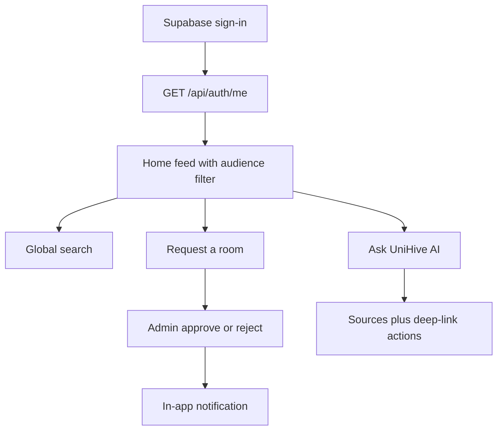
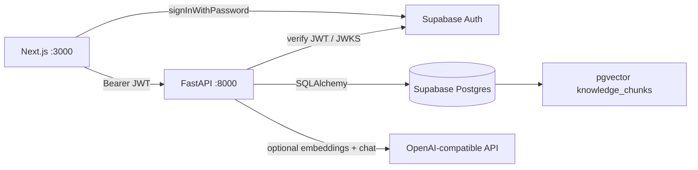
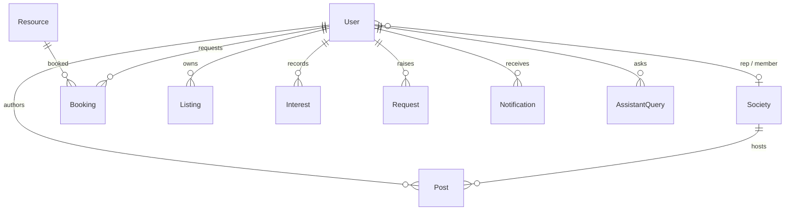

# DevDash'26 Project Report

**Team name:** Team Axiom  
**Product:** UniHive — Everything campus. One place.  
**Repository:** [DevDash-26/Team-Axiom](https://github.com/DevDash-26/Team-Axiom) (`dev` branch)  
**Problem statement:** Universal College Lanka students get campus information from WhatsApp groups, notice boards, and word of mouth; UniHive is one trusted channel for announcements, events, societies, bookings, support, and an AI assistant.

---

## 1. Introduction

### 1.1 Problem understanding

Students and staff at Universal College Lanka currently rely on scattered channels. That is slow, uneven, and hard for a small admin office to maintain. Different faculties and years need different messages; societies need a place to publish; classrooms and sports spaces need a booking path that does not start with a phone call.

The users are students (personalised feed and self-service), academics (faculty-scoped publishing and academic support), society representatives (own-society events and updates), finance (aid information), and admins (emergencies, bookings, moderation, roles).

### 1.2 Our solution in brief

UniHive is a web app: Next.js for the campus UI, FastAPI for every campus data path, and Supabase for Postgres plus managed Auth. We did not build 33 separate apps. We built **five engines** (posts, info, bookings, requests, listings) and mapped many requirements onto them. UniHive AI sits on top: campus markdown is chunked into pgvector, answers are grounded in retrieved sources, and the student is sent to the right action (book a room, report a lost item, raise a request).

### 1.3 Scope and priorities

We finished the demo-critical path first (auth, targeting, home, staff publish), then events/societies/bookings, then requests/listings/info, then remaining post types and the assistant RAG loop. We cut a second CMS for info pages and an external vector database so the core stayed deep rather than shallow.

Full traceability is in [REQUIREMENTS.md](REQUIREMENTS.md). Summary:

| ID | Requirement | Status | Where |
|----|-------------|--------|-------|
| BR1 | Unified home + search | Done | `/`, `GET /api/search` |
| BR2 | Targeted announcements | Partial | `post_service.apply_visibility`, PostEditor |
| BR3–BR6 | Events, interest, societies, sign-up | Done | posts + societies + Interest |
| BR7 | Lost & found | Done | listings engine |
| BR8 | Classroom / facility booking | Done | resources + bookings, overlap 409 |
| BR9, BR17, BR21 | Support, feedback, facility issues | Done | request engine + role handlers |
| BR10, BR13, BR16, BR20, BR28 | FAQ, calendar, schedule, jobs, lectures | Done | info + post types |
| BR11–BR12 | Content maintenance, access levels | Partial | permission map + staff UI |
| BR14, BR22, BR25–BR26, BR30–BR31 | Onboarding, directory, dining, printing, IT, library | Partial | seeded info pages (no CMS) |
| BR15 | Emergency communication | Done | banner, in-app + optional SMTP, browser toast |
| BR18–BR19, BR32 | Volunteering, alumni, highlights | Done | post types + `/opportunities` |
| BR23–BR24, BR27, BR29 | Financial aid, sports booking, textbooks, wellbeing | Done | info + booking + listings |
| BR33 | AI assistant | Partial | markdown → pgvector → grounded LLM; staff insights |

---

## 2. Design

### 2.1 Users and roles

| Role | Can do |
|------|--------|
| STUDENT | Personalised feed, search, events/societies interest, bookings, listings, requests, assistant, profile |
| ACADEMIC | Publish announcements / calendar / guest lectures for own faculty; handle academic support |
| SOCIETY_REP | Publish events, society updates, and highlights for own society |
| FINANCE | Profile; financial-aid info is seeded (no separate CMS) |
| ADMIN | Emergencies, jobs, volunteering, alumni, booking approve/reject, listing moderate, FAQ create, assistant insights |
| SUPER_ADMIN | Admin plus user/role management |

Roles live in our `users` table, not in JWT `app_metadata`. The UI hides buttons; FastAPI is the authority (`PERMISSION_ROLES` + `require_permission`).

### 2.2 Key user flows



**Targeting demo:** Nimali (Computing, year 2) and Kasun (Business, year 1) see different posts from the same database.

**Booking demo:** student requests a room → overlap is rejected with 409 → admin approves → student is notified in-app.

**Assistant demo:** “library hours” or “lost my ID” → retrieved chunk/FAQ → short answer with sources and a link to `/lost-found` or `/info`.

### 2.3 UI design decisions

- One App Shell: student, staff, and admin navigation from the same role map.
- Mobile-first, plain labels, loading / empty / error / success states.
- Emergency and schedule-change posts are stronger on the feed and in the site banner. Publishing an emergency writes in-app alerts and emails matching users (or logs a count if SMTP is unset).
- Lost & found contact shows first names only — no emails or phone numbers in the UI.
- Staff interest lists show name and programme, not private contact details.

---

## 3. Architecture

### 3.1 System overview



Campus tables are **not** exposed through PostgREST. RLS is enabled with no anon policies; the publishable key can only sign in.

### 3.2 Technology stack and why

| Layer | Choice | Reason |
|-------|--------|--------|
| Frontend | Next.js App Router, TypeScript, Tailwind, zod | Official scaffold, typed forms, one web client |
| Backend | FastAPI, SQLAlchemy 2, Pydantic v2 | Thin routers, services own rules, pytest-friendly |
| Database | Supabase Postgres | Hosted Postgres a small office can keep; documented deviation from written SQLite |
| Auth | Supabase Auth | Managed passwords; FastAPI still owns roles |
| RAG | Markdown files + pgvector | Same database, no extra vector cluster |
| LLM | Optional OpenAI-compatible chat + embeddings | Search-only fallback if the key or provider is down |

### 3.3 Data model (engines)

Few generic tables, many requirements:



| Engine | Models | Requirements served |
|--------|--------|---------------------|
| Post | `Post` (`type`, audience, schedule, pin, status, `society_id`) | Announcements, events, lectures, emergency, schedule, calendar, jobs, volunteering, alumni, highlights, society updates |
| Info | `InfoPage`, `Faq`, `StaffContact` | FAQ, onboarding, directory, aid, dining, printing, wellbeing, IT, library, sports info |
| Booking | `Resource(kind)`, `Booking(status)` | Classrooms and sports facilities |
| Request | `Request(type, status)` | Academic support, facility issues, feedback |
| Listing | `Listing`, `Interest`, `SocietyMembership` | Lost & found, textbooks, event interest, society sign-up |
| Platform | `User`, `Society`, `AssistantQuery`, `AuditLog`, `Notification` | Auth profiles, AI log, publish audit, booking outcomes |

**Audience rule:** a student sees a post if every non-null `faculty` / `year` / `programme` matches their profile. Null on a field means “everyone for that field”. Staff see all published posts. Anonymous callers see only campus-wide posts.

**Booking rules (constants, not magic numbers):** 30–240 minutes, 08:00–20:00, at most 14 days ahead, overlapping PENDING/APPROVED bookings return 409.

### 3.4 API surface

| Area | Paths |
|------|--------|
| Health | `GET /health`, `GET /ready` |
| Auth | `GET/PATCH /api/auth/me` |
| Posts | `GET/POST /api/posts`, get/patch/archive, `POST /api/posts/{id}/interest` |
| Search | `GET /api/search` (posts; FAQ, society, room extras on page 1) |
| Info | `/api/info/pages`, `/faqs`, `/contacts` |
| Bookings | `/api/resources`, `/api/bookings` (create, mine, staff list, approve/reject) |
| Societies | `/api/societies`, interest/sign-up |
| Listings | `/api/listings` (LOST/FOUND default; `type=TEXTBOOK`) |
| Requests | `/api/requests` with allowed status transitions |
| Assistant | `POST /api/assistant/chat`, feedback, `GET /api/admin/assistant/insights` |
| Notifications | `/api/notifications` |

### 3.5 Project structure

```
backend/app/          factory, constants, security, models, schemas, routers, services, seed
backend/app/assistant/  guard → intent → retrieve → grounded answer → log
backend/knowledge/      campus markdown indexed into pgvector
backend/tests/          pytest
frontend/src/         App Router, components, lib/api.ts, lib/auth.ts
```

---

## 4. Implementation highlights

### 4.1 Permission map

Actions are keys in `PERMISSION_ROLES` (`backend/app/constants.py`). Ownership (own faculty / own society) is checked in `post_service`, not with scattered `if role ==` in routers. Examples: students cannot publish announcements (403); academics cannot publish another faculty’s announcement; academics cannot handle facility issues; only admins approve bookings.

### 4.2 UniHive AI (BR33)

Pipeline (plain functions, no orchestration framework):

1. **Scope** — refuse off-topic or unsafe questions with a template (no LLM answer).
2. **Intent** — INFO, EVENT, BOOKING, LOST_FOUND, SUPPORT, SOCIETY, OTHER.
3. **Retrieve** — embed the question, nearest `knowledge_chunks` via pgvector; merge keyword hits from FAQs, info pages, staff directory, and published posts the user may see. If embeddings are missing, keyword match on the same chunks.
4. **Answer** — LLM may use only retrieved context. If the key/provider fails, return search-only with `fallback=true`.
5. **Guide** — attach sources plus deep links (`/bookings`, `/lost-found`, `/requests/new`, …).
6. **Learn** — log `AssistantQuery`; admins see unanswered / low-rated questions on `/staff/assistant`.

Knowledge files: `backend/knowledge/{campus-services,student-services,library,it}.md`. Seed indexed **11 chunks, 11 embedded** via pgvector when `LLM_API_KEY` and `LLM_BASE_URL` are set.

Multilingual helpers detect English, Sinhala script, and Singlish particles so retrieval strips noise and canned replies follow the student’s language.

### 4.3 Supabase boundary

The browser uses supabase-js only to sign in. Seed uses the service role to create Auth users. Demo password is documented in the README (`CampusHub!2026`). No real student data.

---

## 5. Non-functional quality

| Area | What we did |
|------|-------------|
| AuthZ | JWT verify + `require_permission` on every mutating route |
| Validation | Pydantic on the API, zod on forms; 422 on empty title / bad dates / unknown faculty |
| Errors | `{error: {code, message}}`; frontend empty/error/retry |
| Security | RLS with no anon table access; no service role in Next.js; no emails on post authors |
| Conflicts | Booking overlap 409; unique Interest; FAQ duplicate check |
| Privacy | Lost & found contact = first name only |
| Reliability | `/health` always up; `/ready` reports DB; assistant fallback if LLM is down |
| Logging | Server logs on unhandled errors; assistant latency on query rows; no secrets in logs |
| Maintainability | Layers, named constants, idempotent seed, `make install/seed/dev/test` |

---

## 6. Testing

### 6.1 Strategy

pytest against the configured Postgres URL. Tests override Auth except for the invalid-JWT case. The LLM and Auth Admin APIs are not called in unit tests. Run: `make test` (needs `DATABASE_URL`).

### 6.2 Test inventory (71 cases)

| File | Coverage |
|------|----------|
| `test_auth.py` | 401 without token, garbage JWT, profile GET/PATCH |
| `test_posts.py` | Targeting, 403s by role, validation 422, create/edit/archive, event interest, search audience |
| `test_bookings.py` | Create, overlap 409, student cannot approve, admin approve |
| `test_societies.py` | List + student interest |
| `test_listings.py` | Lost item + textbook, resolve ownership, duplicate interest 409 |
| `test_requests.py` | Create, illegal skip 409, academic vs facility handler |
| `test_info.py` | FAQ search (Singlish), duplicate check, category pages |
| `test_assistant.py` | Out-of-scope refusal, sources/actions, lost-ID action, staff directory, admin insights 403 |
| `test_assistant_language.py` | Sinhala / Singlish / English detection |
| `test_knowledge_chunks.py` | Markdown split + bundled files load |

### 6.3 Evidence

| ID | Scenario | Expected | Status |
|----|----------|----------|--------|
| T-01 | No token / garbage JWT | 401 | Written |
| T-02 | Computing vs Business students | Different visible titles | Written |
| T-03 | Student creates announcement | 403 | Written |
| T-04 | Empty title | 422 | Written |
| T-05 | Overlapping booking | 409 | Written |
| T-06 | Academic handles facility issue | 403 | Written |
| T-07 | Off-topic assistant question | Refusal, no invented answer | Written |
| T-08 | Seed knowledge index | 11 chunks, 11 embeddings | Verified on 2026-09-19 (`make seed`) |

Live pytest against the shared hosted database can contend with seed/demo traffic; treat `make test` on a quiet clone as the evidence run for judges.

### 6.4 Known issues

- The app will not run without Supabase credentials and a network path (hotspot is the backup).
- `create_all` does not migrate existing columns; schema changes need a reset or SQL.
- Shared demo DB is not isolated; tests use rollback but can still see live rows.

---

## 7. Setup and running

See [README.md](README.md).

```bash
make install
make seed
make dev
```

API http://localhost:8000 · app http://localhost:3000. Demo accounts are in the README. Pitch steps are in [DEMO.md](DEMO.md).

---

## 8. Limitations and future work

**Left out on purpose**

| What | Why |
|------|-----|
| Separate app per requirement | Engine reuse; depth scores higher than 33 thin screens |
| Qdrant / extra vector DB | pgvector on the same Postgres |
| Info-page CMS | Seed is the maintenance path for a 6-hour demo |
| Native apps, dark mode, analytics | Responsive web was enough |
| University SIS / SMS | No SIS; no phone numbers stored. Emergencies email via optional SMTP |

**Known limitations**

- Hosted Supabase is a single-network dependency.
- Info pages are read-only in the UI (FAQ create exists for admins).
- Emergency alerts are in-app + optional email + browser toast. No SMS or mobile push.
- Assistant quality depends on markdown coverage and the embedding/chat key.

**Next (after the hackathon)**

- Info CMS if staff need to edit pages without re-seeding.
- Isolated test database so pytest never touches demo data.
- Rate limits on assistant chat for semester-start load.

---

## 9. Third-party libraries, APIs, and AI usage

See [DISCLOSURES.md](DISCLOSURES.md).

AI was used as an aid (Cursor) for scaffolding, tests, and docs. Architecture, permission matrix, audience rule, and engine model were team decisions. Every committed change was reviewed. The assistant RAG pattern (retrieve → ground → cite → fallback) was written for this repo; we did not copy a prior team project or LangChain stack.

---

## 10. Team contributions

| Member | Main areas (from commit history) |
|--------|----------------------------------|
| Mirco Fernando | Backend engines (posts, requests, listings, bookings, societies), API wiring, merges to `dev` |
| Nethmi Imasha Arachchi | UniHive AI (multilingual, markdown/pgvector RAG), FAQ intelligence, Render deploy config |
| Dhanuja Senarathna | Frontend UI, UniHive branding, student/staff navigation, lost & found / opportunities / profile |
| Mahdi Hannan | Repository bootstrap |

Each teammate should speak to the parts they committed. Technical Q&A: backend/auth/RAG and frontend/UI as above.
